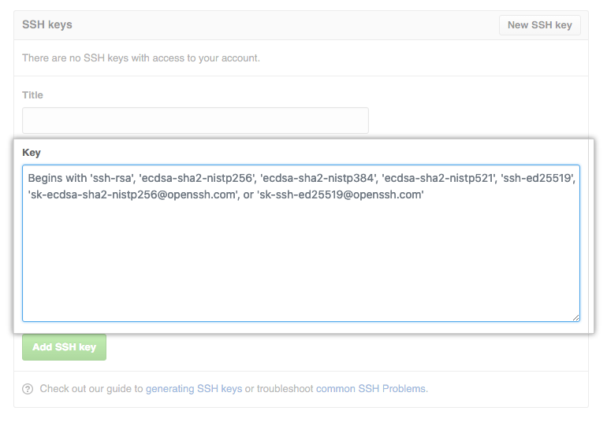

# Github

## What is Github?
::: columns

:::: column
- "a code hosting platform for version control and collaboration"
- a remote git repository, where you can
  - work collaboratively
  - in a version controlled way,
  - discuss changes "where they are made",
  - interact with other users
- or simply back up your stuff remotely

::::

:::: column


::::

:::

## Collaboration


# Github repository

## Your Github repository
- has a name (github.com/yourname/yourrepo)
- settings:
  - private or public
    - private: you decide who can see it
    - public: everyone can see it
    - both: YOU decide who commits
  - initialize with a README?
  - add a gitignore?
  - choose a license

## Short excursion: **README**

What is a README.md?

- md = markdown:
  - very simple markup language
  - hashtags (#) for headers
  - minus (-) for bullet points
  - asterisk (\*) to make things italic: \*italic\*: *italic*
  - ...
  - git can track changes, because it's simple text
- README
  - a file that gets displayed first in the repo
  - project title
  - description
  - how to use the code (from data, workflows,... to licenses)
  - how to contribute
  - how to cite

## Let me show you

Follow if you are fast enough, otherwise there will be time later!
<!-- Sophie shows how to create a new github project -->

# Connecting to Github

<!-- Florian takes over -->

## Authentification with SSH

1. Testing your SSH connection [[GitHub Docu]](https://docs.github.com/en/authentication/connecting-to-github-with-ssh/testing-your-ssh-connection)
2. Generate a new SSH Key [[GitHub Docu]](https://docs.github.com/en/authentication/connecting-to-github-with-ssh/generating-a-new-ssh-key-and-adding-it-to-the-ssh-agent)
3. Adding a new SSH key to your GitHub account [[GitHub Docu]](https://docs.github.com/en/authentication/connecting-to-github-with-ssh/adding-a-new-ssh-key-to-your-github-account)
4. Testing your SSH connection (step 1)

### Testing your SSH connection

```bash
ssh -T git@github.com # Attempts to ssh to GitHub
```

```bash
# it worked!
> The authenticity of host 'github.com (IP ADDRESS)' can't be established.
> RSA key fingerprint is SHA256:nThbg6kXUpJWGl7E1IGOCspRomTxdCARLviKw6E5SY8.
> Are you sure you want to continue connecting (yes/no)?
> Hi username! You've successfully authenticated, but GitHub does not
> provide shell access.
```

```bash
# SSH key is missing
> Permission denied (publickey).
```

### Generating a new SSH key

```bash
ssh-keygen -t ed25519 -C "your_email@example.com" # use your GitHub Email
> Generating public/private algorithm key pair.
> Enter a file in which to save the key (/c/Users/you/.ssh/id_algorithm): # press enter
> Enter passphrase (empty for no passphrase): # type a passphrase
> Enter same passphrase again: # type passphrase again
```

### Adding a new SSH key to your GitHub account

```bash
clip < ~/.ssh/id_ed25519.pub #copies key to your clipboard
```

### Go to GitHub online (Part 1)

In the upper-right corner of any page, click your profile photo, then click Settings.


### Go to GitHub online (Part 2)

In the "Access" section of the sidebar, click "SSH and GPG keys".
Click New SSH key or Add SSH key.


In the "Title" field, add a descriptive label for the new key. For example, if you're using a personal Mac, you might call this key "Personal MacBook Air".

Paste your key into the "Key" field.



Click Add SSH key.

### Testing your SSH connection

```bash
ssh -T git@github.com # Attempts to ssh to GitHub
```

```bash
# it worked!
> The authenticity of host 'github.com (IP ADDRESS)' can't be established.
> RSA key fingerprint is SHA256:nThbg6kXUpJWGl7E1IGOCspRomTxdCARLviKw6E5SY8.
> Are you sure you want to continue connecting (yes/no)?
> Hi username! You've successfully authenticated, but GitHub does not
> provide shell access.
```

## Let's check: Does this work for all of you?

# Workflow

## Connecting remote and local repos

- easiest way: *clone* the github repository to your own computer
- = download the folder that is your repository

- use :
``` bash
cd /path/to/where/you/want/it
git clone "github.com/yourname/yourrepo"
```

--> creates new git-repository /path/to/where/you/want/it/yourrepo

- now change / add / commit as you want
- your local repo then has an "origin", which is the remote github repo from where you cloned

## Synchronise your local and remote repos

- we want to synchronise them, so they have the same commit history
  - **push**: uploades changes **to** remote
  - **pull**: downloads (`git fetch`) and merges (`git merge`) changes **from** the remote in one go
  - ONLY commited changes get copied

- `git clone`: needs to be done once
- `git pull`: anytime something in the remote has been changed

## Synchronise your local and remote branches

- pull and push can be done with specific branches 
```
git push origin main # pushes main branch to remote's main
```
- same structure for other branches:

```
git pull <branch_remote> <branch_local> 
```

## Push doesn't work?  

```
(base) sophie@idhrenisle:
~/R/caa2022_GitGitHub_workshop/slides
$ git push origin main            
To github.com:sslarch/caa2022_GitGitHub_workshop.git          
! [rejected]    main -> main (fetch first)    
``` 
--> solution: pull! 

```
(base) sophie@idhrenisle:
~/R/caa2022_GitGitHub_workshop/slides
$ git pull origin main 
```...
```
Von github.com:sslarch/caa2022_GitGitHub_workshop            
 * branch            main       -> FETCH_HEAD                
   89c51f9..05066e5  main       -> origin/main                
Merge made by the 'recursive' strategy.
```
- and now push again. :-) 

## If Merge doesn't work?  

- if you pull sth that can't be merged automatically
  - DON'T PANIC

In the file you will find "conflict markers":
- `<<<<<<<HEAD.`:  beginning of the conflict, now you version of the text is shown
- `======= `:  divides your version from the changes in the other branch
- `>>>>>>> BRANCH-NAME` : end of the problem with the name of the "rival" branch

## Merge conflict example

- one person wrote "open an issue" in the base or HEAD branch
- another person wrote "ask your question in IRC" in the compare branch or branch-a.
- both the same line --> git doesn't know which to save

```
If you have questions, please
<<<<<<< HEAD
open an issue
=======
ask your question in IRC.
>>>>>>> branch-a
``` 
## Merge conflict solution

- easy way:
  - amend the affected lines by hand
  - delete the conflict markers
  - save
  - git add
  - git commit
  
- nothing gets overwritten by accident!

## Visualisation of Workflow


<!--- show these steps 
1. create github repository
2. clone it
3. change readme
4. add and commit
5. push
--->

# Excercise 

<!--- workshop content --->
## Create and use your Github repository

::: columns

:::: column
- open Github and log in
- create a new repository
  - make it public
  - initialize with a README
  - add a gitignore
- now:

``` bash
cd /path/to/where/you/want/it
git clone "github.com/yourname/yourrepo"
```
::::

:::: column
- open the README.md
- write a couple of words
- git add
- git commit
- git push

::::

:::


**Well done!**

# Collaborating

## Issues: Github's space for discussions 

- can be created by anyone to suggest additions, changes, ...
- discussion thread of comments
- to dos
- assign people to tasks
- link comments to commits / code lines (?)

- *close* them when done discussing!


## Pull requests: Github's infrastructure for collaboration

- public repositories can be *forked* by anybody
  - = make a copy to your own profile
  - there make all the changes and commits you want
  - want to suggest changes to the owner of the original repo?   
--> create a *pull request* (PR)

- owner looks at your commits and decides whether they want to integrate the changes or not
- you can *comment* the PR & discuss changes

<!--- show and tell with 1 partner: https://github.com/florianthiery/testrepo --->

# Excercise 

## Collaborating with a partner

<!--- workshop content --->

- take a partner
- exchange URLs of your repositories
- fork the repo of your partner
- clone it to your computer
- add a sentence to his readme
- git add, commit, push
- create a pull request

- partner merges

**Wow!**
