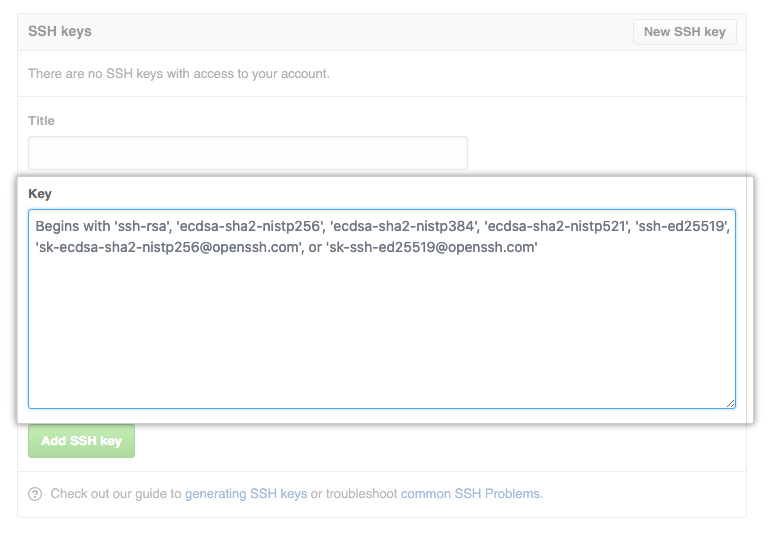

## Authentification with SSH

1. Testing your SSH connection [GitHub Docu](https://docs.github.com/en/authentication/connecting-to-github-with-ssh/testing-your-ssh-connection)
2. Generate a new SSH Key [GitHub Docu](https://docs.github.com/en/authentication/connecting-to-github-with-ssh/generating-a-new-ssh-key-and-adding-it-to-the-ssh-agent)
3. Adding a new SSH key to your GitHub account [GitHub Docu](https://docs.github.com/en/authentication/connecting-to-github-with-ssh/adding-a-new-ssh-key-to-your-github-account)
4. Testing your SSH connection (step 1)

### Testing your SSH connection

```bash
ssh -T git@github.com # Attempts to ssh to GitHub
```

```bash
# it worked!
> The authenticity of host 'github.com (IP ADDRESS)' can't be established.
> RSA key fingerprint is SHA256:nThbg6kXUpJWGl7E1IGOCspRomTxdCARLviKw6E5SY8.
> Are you sure you want to continue connecting (yes/no)?
> Hi username! You've successfully authenticated, but GitHub does not
> provide shell access.
```

```bash
# SSH key is missing
> Permission denied (publickey).
```

### Generating a new SSH key

```bash
ssh-keygen -t ed25519 -C "your_email@example.com" # use your GitHub Email
> Generating public/private algorithm key pair.
> Enter a file in which to save the key (/c/Users/you/.ssh/id_algorithm): # press enter
> Enter passphrase (empty for no passphrase): # type a passphrase
> Enter same passphrase again: # type passphrase again
```

### Adding a new SSH key to your GitHub account

```bash
clip < ~/.ssh/id_ed25519.pub #copies key to your clipboard
```

### Go to GitHub online (Part 1)

In the upper-right corner of any page, click your profile photo, then click Settings.


### Go to GitHub online (Part 2)

In the "Access" section of the sidebar, click "SSH and GPG keys".
Click New SSH key or Add SSH key.


In the "Title" field, add a descriptive label for the new key. For example, if you're using a personal Mac, you might call this key "Personal MacBook Air".

Paste your key into the "Key" field.



Click Add SSH key.

### Testing your SSH connection

```bash
ssh -T git@github.com # Attempts to ssh to GitHub
```

```bash
# it worked!
> The authenticity of host 'github.com (IP ADDRESS)' can't be established.
> RSA key fingerprint is SHA256:nThbg6kXUpJWGl7E1IGOCspRomTxdCARLviKw6E5SY8.
> Are you sure you want to continue connecting (yes/no)?
> Hi username! You've successfully authenticated, but GitHub does not
> provide shell access.
```